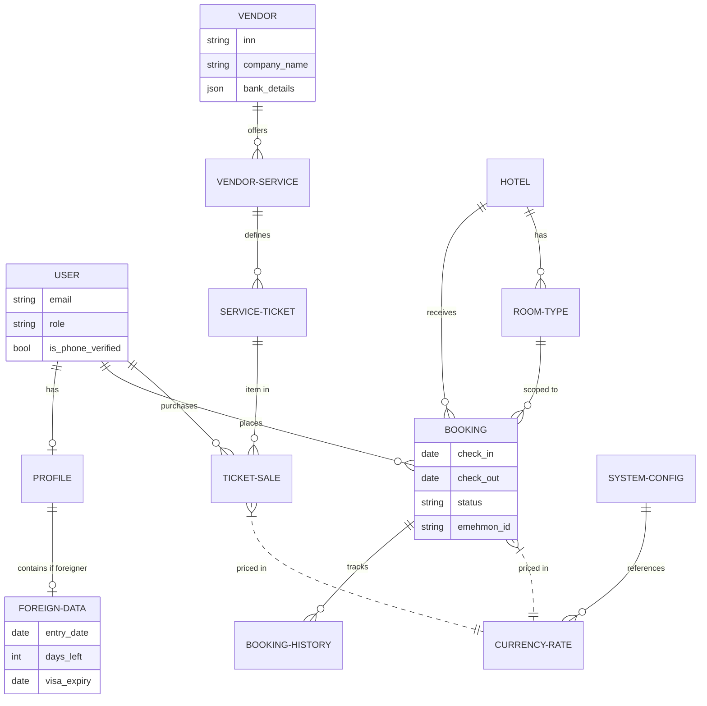
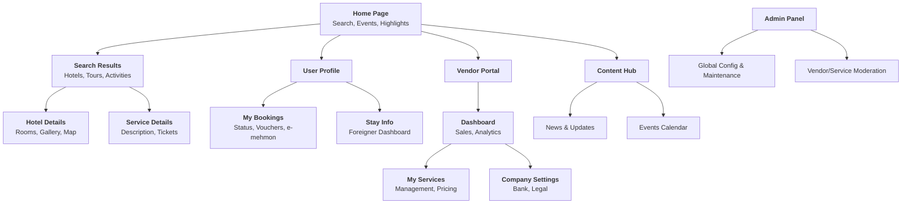
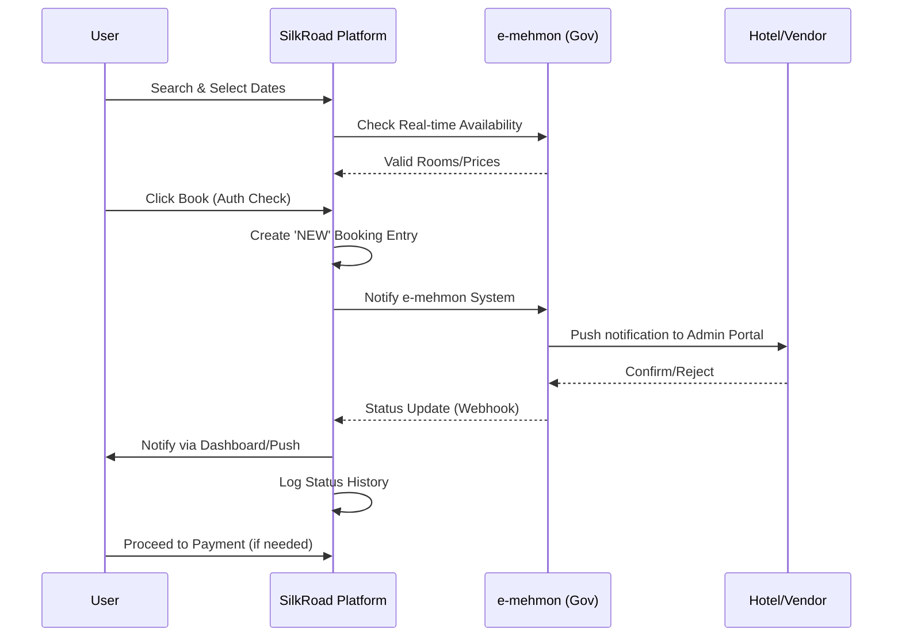
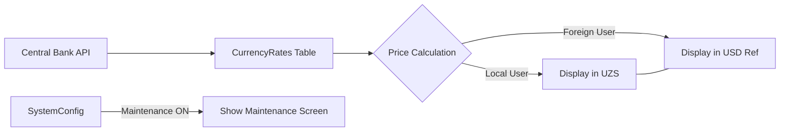

# SilkRoad System Visualization

This document provides a comprehensive visual guide to the SilkRoad platform's architecture, navigation, and logic.

## 1. Entity-Relationship Diagram (Database)

The following diagram shows how the core enterprise entities interact within the system.

## 2. Platform Site Map (Navigation Hierarchy)

## 3. Core Business Logic (Booking Workflow)

## 4. Currency Logic (Enterprise Config)

